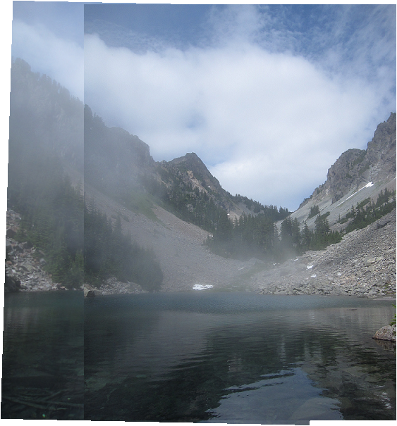
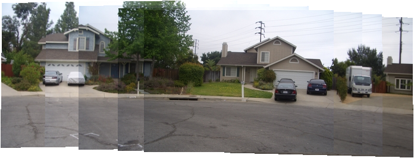

# 洪章瑋 <span style="color:red">(102062171)</span>

# Project 2 / Panorama Stitching

## Overview
The project is related to 
> This projects implemented basic image stitching algorithm with SIFT feature descriptor and affine transform matrix. For now, this version cannot support unordered image set.


## Implementation
1. SIFT Feature extraction
	* Use 'vl_sift' to extract SIFT features
	* Result
	
2. SIFT Feature matching
	1. Compute Euclidean distance in each pair
	```
	distance = pdist2(descriptor1, descriptor2);
	```
	2. Compute ratio of 1st nearest pair and 2nd pair (i.e. 1st nearest distance / 2nd nearest distance)
	3. Filter out ratio < thresh
	4. Result  
	
	
3. Compute affine matrix
	* We have H * P1 = P2
	* Compute H = (P1' \ P2')'
	* Result
	
4. RANSAC affine matrix computation
	1. Transform points in P1 to P2 with H
	2. Compute sum of error (Euclidean distance)
	```
	sqrt(sum(((pt2_h - H * pt1_h).^2)))
	```
5. Multiple image stitch
	1. Initialize T = eye(3)
	2. currentFrameIndex < refFrameIndex
	```
	for k = currentFrameIndex:refFrameIndex - 1
        	T = i_To_iPlusOne_Transform{k} * T;
    	end
	```
	3. currentFrameIndex > refFrameIndex
	```
	for k = currentFrameIndex:-1:refFrameIndex + 1
        	T = pinv(i_To_iPlusOne_Transform{k-1}) * T;
    	end
	```

## Installation
* Other required packages.
	* vlfeat
* How to compile from source?
	1. run('VLFEATROOT/toolbox/vl_setup')
		* VLFEATROOT is your vlfeat installtion directory
	2. cd 'code'
	3. Run 'StitchTester'
		* change input image in StichTester.m

### Results
* Run StitchTester with default settings
<table border=1>
<tr>
<td>

</td>
</tr>
<tr>
<td>

</td>
</tr>
<tr>
<td>

</td>
</tr>
<tr>
<td>

</td>
</tr>
<tr>
<td>

</td>
</tr>
<tr>
<td>

</td>
</tr>
<tr>
<td>

</td>
</tr>
<tr>
<td>

</td>
</tr>
<tr>
<td>

</td>
</tr>
<tr>
<td>

</td>
</tr>

</table>
